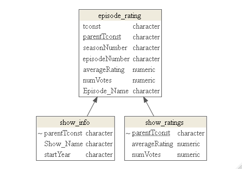

```{r setup, include=FALSE}
knitr::opts_chunk$set(echo = TRUE)
```

## Relational databases

A **relational database** is a type of database that stores data in tables, where each table represents an entity (such as a customer, product, or order) and each row represents a record of that entity. The data is organized into columns, which represent attributes or properties of the entity.
The key concept behind a relational database is the idea of relationships between tables. Tables can be related to each other through the use of keys, which are columns in a table that uniquely identify each row in that table. A key in one table can be used to create a relationship with another table, where the key in one table is used as a reference to the corresponding row in another table.

For example, below is a diagram showing the relationship between three tables of IMDb TV show data – similar to what was prepared for you in your earlier project.  These diagrams are called ER (Entity-Relationship) diagrams and are a visual representation of the relationships between entities (such as TV shows, episodes and ratings.) in a database.



**SQLite** is a popular relational database management system (RDBMS). It is widely used in various applications, including web browsers, operating systems, mobile devices, and more. SQLite is open-source software and is free to use and distribute. SQLite is a lightweight, serverless, self-contained, and transactional RDBMS that is widely used in applications that need to store data locally.

Other popular RDBMS include MySQL, PostgreSQL, Oracle, and Microsoft SQL.

## Introduction to SQL using R

`SQL` (Structured Query Language) is a programming language used to manage and manipulate data stored in relational databases. While `SQL` is its own language R (and other popular languages such as Python) provides several packages to connect and interact with databases using `SQL`. 

The basics of using `SQL` is very similar to the main verbs in `dplyr`. In fact, there is a package called `dbplyr` in R that extends `dplyr` functionality to databases. Although the `dplyr` (and `dbplyr`) verbs can often solve a problem that you are likely to come across, learning `SQL` can be a valuable skill in industry.

For example, here are a few common `SQL` commands and their `dplyr` equivalences.

| SQL | dplyr |
| --- | --- |
| SELECT | select |
| FROM | from |
| WHERE | filter |
| GROUP BY | group_by |
| HAVING | filter |
| ORDER BY | arrange |
| JOIN | left_join, right_join, inner_join, full_join |
| UNION | bind_rows |

### Commonly used R packages to assist in analyzing databases

1.	`DBI`: This is the standard interface for communicating with databases in `R`. It provides a consistent set of functions for connecting to and interacting with databases, regardless of the specific database management system being used.

2.	`RSQLite`: This is an `R` package that allows you to create and manipulate SQLite databases directly from `R`.  RSQLite is a DBI-compatible interface which means you primarily use functions defined in the DBI package, so you should always start by loading DBI, not RSQLite.

3.	`dplyr` and `dbplyr`: Can be used for fairly straightforward queries as it auto-translates `dplyr` commands into `SQL`.

4.	`sqldf`: `sqldf` is an `R` package for running `SQL` statements on `R` data frames, optimized for convenience.


## Examples

The file `imdb_tv.sqlite` is an SQLite database that contains information on the very popular TV shows that started since 2015.

1. Load the appropriate packages to connect to and analyze this database.

```{r}
library(DBI) # we will then use the RSQLite package only for connecting to our db
library(dplyr)
library(dbplyr) # we will see how to use dplyr verbs to make some simple queries
```

2. Use `dbConnect()` to establish a connection to the imdb_tv.sqlite database.

```{r}
imdb_db <- dbConnect(RSQLite::SQLite(), 
                 dbname = "data/imdb_tv.sqlite")

```

3. A first step would be to check which tables are available in the database. Then, for each table we can check the fields (i.e., variables) stored within each.


```{r}
# use DBI command

```

```{r}
# list field for one table


# quick trick to print out the Fields for each table
n_tables = length(dbListTables(conn = imdb_db) ) 
for(i in 1:n_tables){
  tbl_name <- dbListTables(conn = imdb_db)[i]
  print(paste("Table: ",tbl_name))
  print( dbListFields(conn = imdb_db, tbl_name) )
  cat(paste0("\n\n"))
}

```


4. Load an entire table in R (as a data frame). IMPORTANT NOTE - in many cases SQL databases contain a huge amount of data. You should always be aware of how large your dataset is before attempting to load it in to your R environment.


Using DBI
```{r}

```

Using dplyr
```{r}

```

5. Simple queries

a. Determine the number of rows in each table

```{r}

```

Using DBI:

```{r}
res <- dbSendQuery(imdb_db, query)
dbFetch(res)
```

Using dplyr
```{r}
tbl(src = imdb_db, "episode_rating") %>% 
#  count()
  summarize(n = n()) 

```


b. Finding the max number of votes in an episode

DBI

```{r}
query = 
  
res <- dbSendQuery(imdb_db, query)
dbFetch(res)
```

dplyr
```{r}
imdb_db %>%
  tbl("episode_rating") %>%
  summarize(maxVote = max(numVotes))
```

c. Keep only the episodes with averageRatings below 5. Return only the parentTconst, rating, votes, and episode name.

DBI
```{r}
query =
  
  
res = dbSendQuery(imdb_db, query)
episode_subset <- dbFetch(res)
episode_subset
```

dplyr
```{r}
episode_subset2 <-
  imdb_db %>%
    tbl("episode_rating") %>%
    filter(averageRating < 5) %>%
    select(parentTconst, averageRating, 
           numVotes, Episode_Name) %>%
    collect()
episode_subset2
```


6. Queries on multiple tables.

This data is far more interesting when you combine the information from multiple tables. In particular, attaching the show's name and overall rating to the episode information.

The keys we will need to link these tables to each other are stored in the parentTconst field. This value is the identify of the show. (The tconst field in the episode_rating table is the identifer for the specifical episode.)

a. Join the show information (show_info table) to the show ratings table.

DBI:
```{r}
query = 

  
res = dbSendQuery(imdb_db, query)
show_df <- dbFetch(res)
```

dplyr
```{r}
dbListTables(imdb_db)

# grab necessary tables (but don't collect them)
show_ratings_db <- imdb_db %>% tbl("show_ratings")
show_info_db <- imdb_db %>% tbl("show_info")


show_df2 <-  left_join(x = show_ratings_db, 
                      y = show_info_db, 
                      by = "parentTconst") %>%
  collect()
```

b. Now all this information to the episode information!

DBI
```{r}
query = 

res = dbSendQuery(imdb_db, query)
imdb_df <- dbFetch(res)
```


dplyr
```{r}
show_ratings_db <- imdb_db %>% tbl("show_ratings")
show_info_db <- imdb_db %>% tbl("show_info")
episode_rating_db <- imdb_db %>% tbl("episode_rating")

imdb_df2 <-  left_join(x = show_ratings_db, 
                      y = show_info_db, 
                      by = "parentTconst") %>%
             left_join(y = episode_rating_db, 
                      by = "parentTconst") %>%
              collect()

```

7. (Just for fun) For each show, calculate the difference between the show's overall rating and the mean of the averageRatings of each episode. Sort the result.

```{r}
imdb_df2 %>%
  rename(episodeRating = averageRating.x,
         showRating = averageRating.y,
         episode_numVotes = numVotes.x,
         show_numVotes = numVotes.y,
         ) %>%
# you take over from here


```

98. Save the joined tables as a csv file for later.


99. Always a good practice to use `dbDisconnect()` when you are finished to disconnect to the database.

```{r}
dbDisconnect(imdb_db)
```

